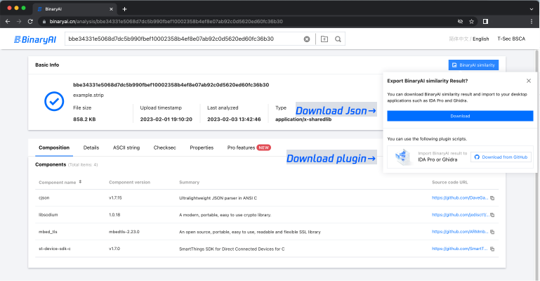
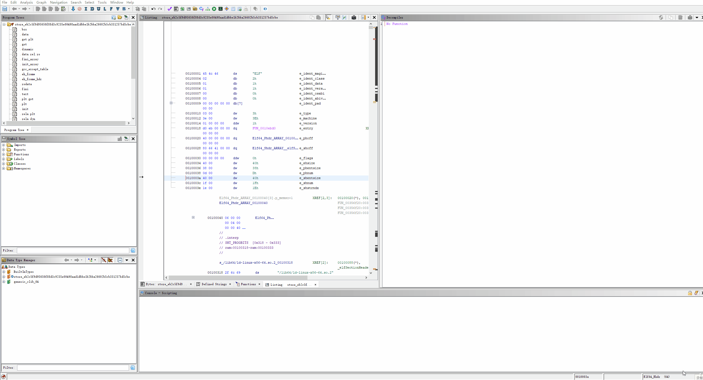
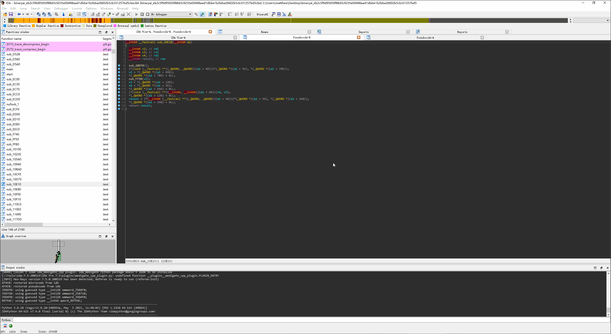

# BinaryAI Plugin for Ghidra / IDA Pro

Upload your binary to [binaryai.net](https://www.binaryai.net) and wait for the analysis finishes, then you can download the result json file with `BinaryAI similarity` button.
Or try with binaries and results in `samples`.

## Load result with Ghidra
1. Download `binaryai.py` and put it in `$USER_HOME/ghidra_scripts`
2. Open your binary in Ghidra
3. Open `Window -> Script Manager`, find `binaryai.py` and double click to run script
4. Select the result json file downloaded from [binaryai.net](https://www.binaryai.net) in the file dialog
5. Open `Window -> Bookmark` to see all matched functions in `BinaryAI` category, navigate in code browser to see matched function details

## Load result with IDA Pro
1. Download `binaryai.py` and put it in `$IDA_INSTALL_DIR/plugins`
2. Install dependency: `pip install pygments`
2. Open your binary in IDA Pro
3. Invoke the plugin with `Ctrl-Shift-B` or `Edit -> Plugins -> BinaryAI`
4. Select the result json file downloaded from [binaryai.net](https://www.binaryai.net) in the file dialog
5. Matched functions will be highlighted in `Functions window`, navigate in `IDA view` or `Pesudocode view` to see matched function details
